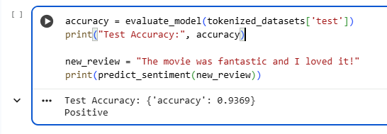

IMDB Movie Review Sentiment Analysis using Fine-Tuned DistilBERT
Project Description
This project performs sentiment analysis on movie reviews from the IMDB dataset, classifying the reviews as positive or negative. We fine-tune a pre-trained transformer model, DistilBERT, for this binary text classification task. The project demonstrates end-to-end NLP model fine-tuning, evaluation, and prediction using Hugging Face Transformers and PyTorch.

Features
Dataset: IMDB movie reviews dataset with 50,000 labeled samples.

Model: Fine-tuned DistilBERT Transformer model optimized for sentiment classification.

Tokenization: Text preprocessed with Hugging Face tokenizer for input standardization.

Training: Leverages Hugging Face Trainer API and PyTorch with GPU acceleration.

Evaluation: Accuracy evaluation on test set with detailed performance metrics.

Prediction: Simple function to predict sentiment for new inputs.

Usage
Clone this repository.

Run the Jupyter/Colab notebook to fine-tune the model or load pretrained saved model.

Use the provided prediction function to classify new movie reviews.

Results
Model evaluation on the test set shows strong classification accuracy:

text
Test Accuracy: {'accuracy': 0.9369}
Sample Prediction
python
new_review = "The movie was fantastic and I loved it!"
print(predict_sentiment(new_review))
# Output: Positive
Screenshot of Model Evaluation and Prediction
*

Tools & Technologies Used
Python 3.14.0

PyTorch

Hugging Face Transformers

Hugging Face Datasets

Google Colab (GPU acceleration)

Jupyter Notebook

Why This Project?
This project demonstrates the practical application of transfer learning in NLP by fine-tuning a compact yet powerful transformer model (DistilBERT). It provides hands-on experience with modern frameworks and a strong foundation in NLP workflows, which is valuable for AI/ML portfolios and interviews.
